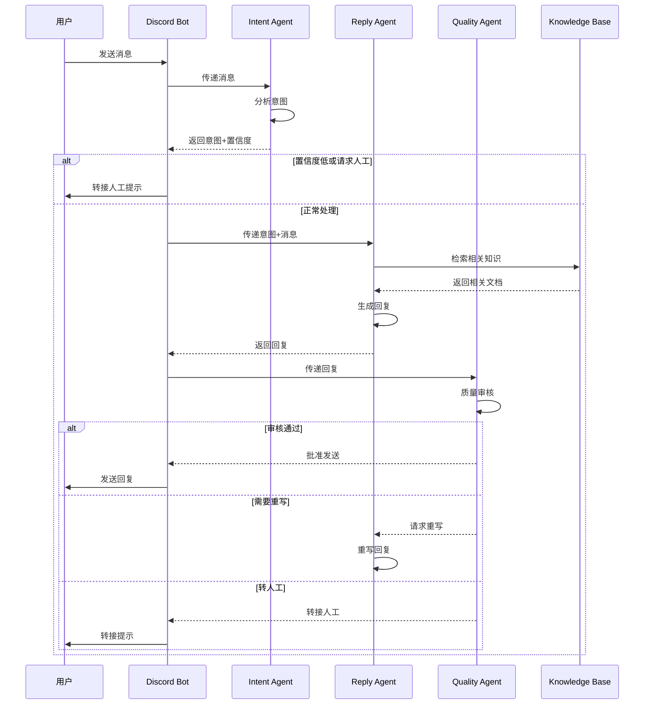

# Discord Multi-Agent Support System

<div align="center">

基于 Hermes Agent 的智能多 Agent 协作 Discord 客服系统

[](LICENSE)
[](https://www.python.org/downloads/)
[](https://discord.py.readthedocs.io/)


</div>

---

## 📋 目录

- [项目简介](#-项目简介)
- [核心特性](#-核心特性)
- [系统架构](#-系统架构)
- [快速开始](#-快速开始)
- [配置说明](#-配置说明)
- [使用指南](#-使用指南)
- [技术文档](#-技术文档)
- [开发指南](#-开发指南)
- [测试](#-测试)
- [部署](#-部署)
- [路线图](#-路线图)
- [贡献](#-贡献)
- [许可证](#-许可证)
- [致谢](#-致谢)

---

## 🎯 项目简介

本项目是一个基于 **Hermes Agent** 框架构建的智能 Discord 客服系统，通过三个专业 Agent 的协作，实现 24/7 自动化社区支持。

### 核心价值

| 痛点 | 解决方案 | 效果 |
|------|----------|------|
| 人工客服成本高 | 多 Agent 自动响应 | 降低 80% 人力成本 |
| 响应速度慢 | 实时 AI 处理 | < 10 秒响应 |
| 多语言支持难 | 自动语言检测 | 支持 10+ 语言 |
| 知识库更新慢 | RAG 实时检索 | 始终提供最新信息 |

### 应用场景

- 🏢 **企业技术支持**：7×24 小时客户问答
- 🎮 **游戏社区管理**：多语言玩家支持
- 📚 **开源项目维护**：自动化 Issue 回复
- 🛒 **电商售后客服**：订单、退款、产品咨询

---

## ✨ 核心特性

<details>
<summary><b>🧠 智能意图识别</b> (点击展开)</summary>

- **8 种意图分类**：技术支持、产品咨询、社区规则、账单、功能请求、Bug 报告、闲聊、转人工
- **置信度评分**：只处理高置信度的请求
- **多语言自动检测**：中文、英文、日文、韩文等
- **优先级判断**：紧急问题优先处理

</details>

<details>
<summary><b>💬 专业回复生成</b> (点击展开)</summary>

- **RAG 知识检索**：从知识库中找到最相关的答案
- **上下文感知**：记住对话历史，提供连贯回复
- **个性化模板**：根据不同意图使用不同的回复策略
- **多语言生成**：自动以用户语言回复

</details>

<details>
<summary><b>🔍 质量审核机制</b> (点击展开)</summary>

- **社区规范检查**：确保回复符合社区准则
- **语气和礼貌审核**：保持专业和友好的语气
- **准确性验证**：避免错误信息
- **自动重写**：低质量回复自动重写
- **人工转接**：复杂问题自动转接人工

</details>

<details>
<summary><b>🚀 Hermes Agent 驱动</b> (点击展开)</summary>

- **自进化能力**：从反馈中学习和优化
- **长链推理**：复杂问题分步解决
- **OpenAI 兼容接口**：支持多种 LLM 后端
- **Token 高效**：智能上下文管理

</details>

---

## 🏗️ 系统架构

### 整体架构图

```
┌─────────────────────────────────────────────────────────────┐
│                      Discord Server                         │
│  ┌──────────┐  ┌──────────┐  ┌──────────┐              │
│  │  #支持   │  │  # general│  │  #帮助   │              │
│  └────┬─────┘  └────┬─────┘  └────┬─────┘              │
└───────┼──────────────┼──────────────┼────────────────────┘
        │              │              │
        └──────────────┼──────────────┘
                       │
              ┌────────▼────────┐
              │   Discord Bot   │
              │  (bot.py)       │
              └────────┬────────┘
                       │
        ┌──────────────┼──────────────┐
        │              │              │
   ┌────▼────┐   ┌────▼────┐   ┌────▼────┐
   │ Intent  │   │ Reply   │   │ Quality │
   │ Agent   │──▶│ Agent   │──▶│ Agent   │
   └─────────┘   └─────────┘   └─────────┘
        │              │              │
        └──────────────┼──────────────┘
                       │
              ┌────────▼────────┐
              │  RAG Engine     │
              │  (Knowledge     │
              │   Base)         │
              └─────────────────┘
```

### Agent 协作流程



### 技术栈

| 组件 | 技术 | 用途 |
|------|------|------|
| **Bot 框架** | discord.py 2.3.2 | Discord API 交互 |
| **Agent 框架** | Hermes Agent | 多 Agent 协作 |
| **LLM 后端** | DeepSeek / MiMo | 意图识别+回复生成 |
| **知识检索** | RAG (TF-IDF) | 知识库检索 |
| **向量数据库** | ChromaDB (可选) | 语义检索 |
| **配置管理** | python-dotenv | 环境变量 |
| **测试** | unittest | 单元测试 |

---

## 🚀 快速开始

### 前置要求

- **Python 3.10+**
- **Discord Bot Token** ([创建 Bot](https://discord.com/developers/applications))
- **LLM API Key** (OpenAI / DeepSeek / 硅基流动 / MiMo)

### 安装步骤

#### 1️⃣ 克隆项目

```bash
git clone https://github.com/yourusername/discord-multi-agent.git
cd discord-multi-agent
```

#### 2️⃣ 创建虚拟环境（推荐）

```bash
# Windows
python -m venv venv
venv\Scripts\activate

# macOS/Linux
python3 -m venv venv
source venv/bin/activate
```

#### 3️⃣ 安装依赖

```bash
pip install -r requirements.txt
```

#### 4️⃣ 配置环境变量

```bash
cp .env.example .env
```

编辑 `.env` 文件：

```env
# Discord Bot Token (必填)
DISCORD_TOKEN=your_discord_bot_token_here

# LLM 配置 (必填)
OPENAI_API_KEY=your_api_key_here
OPENAI_BASE_URL=https://api.deepseek.com/v1  # 或其他兼容端点
HERMES_MODEL=deepseek-chat

# 知识库路径 (可选)
KNOWLEDGE_BASE_PATH=./knowledge_base

# 日志级别 (可选)
LOG_LEVEL=INFO
```

#### 5️⃣ 配置 Discord Bot

1. 前往 [Discord Developer Portal](https://discord.com/developers/applications)
2. 创建应用 → 添加 Bot
3. 在 "Bot" 页面启用以下权限：
   - `MESSAGE CONTENT INTENT`
   - `READ MESSAGES`
   - `SEND MESSAGES`
   - `EMBED LINKS`
4. 在 "OAuth2 > URL Generator" 生成邀请链接，邀请 Bot 到服务器

#### 6️⃣ 启动 Bot

```bash
python src/bot.py
```

看到以下输出表示成功：

```
INFO:Discord Multi-Agent Bot:Bot 已登录为 YourBotName#1234
INFO:Discord Multi-Agent Bot:已连接到 1 个 Discord 服务器
```

---

## ⚙️ 配置说明

### 环境变量 (.env)

| 变量名 | 必填 | 说明 | 示例 |
|--------|------|------|------|
| `DISCORD_TOKEN` | ✅ | Discord Bot Token | `MTAx...` |
| `OPENAI_API_KEY` | ✅ | LLM API Key | `sk-...` |
| `OPENAI_BASE_URL` | ❌ | API 端点 (OpenAI 兼容) | `https://api.deepseek.com/v1` |
| `HERMES_MODEL` | ❌ | 模型名称 | `deepseek-chat` |
| `KNOWLEDGE_BASE_PATH` | ❌ | 知识库路径 | `./knowledge_base` |
| `LOG_LEVEL` | ❌ | 日志级别 | `INFO` / `DEBUG` |

### 主流 LLM 配置示例

<details>
<summary><b>DeepSeek</b> (点击展开)</summary>

```env
OPENAI_API_KEY=sk-xxxxxxxxxxxxxxxx
OPENAI_BASE_URL=https://api.deepseek.com/v1
HERMES_MODEL=deepseek-chat
```

</details>

<details>
<summary><b>硅基流动 (SiliconFlow)</b> (点击展开)</summary>

```env
OPENAI_API_KEY=xxxxxxxxxxxxxxxx
OPENAI_BASE_URL=https://api.siliconflow.cn/v1
HERMES_MODEL=deepseek-ai/DeepSeek-V2.5  # 硅基流动的模型 ID
```

**注意**：硅基流动需要使用 `provider/model` 格式

</details>

<details>
<summary><b>小米 MiMo</b> (点击展开)</summary>

```env
OPENAI_API_KEY=your_mimo_api_key
OPENAI_BASE_URL=https://api.mimo.ai/v1
HERMES_MODEL=xiaomi/mimo-v2.5-pro
```

**💰 百万亿 Token 激励计划**：访问 [MiMo 官网](https://mimo.ai) 申请免费 Token！

</details>

<details>
<summary><b>OpenAI</b> (点击展开)</summary>

```env
OPENAI_API_KEY=sk-xxxxxxxxxxxxxxxx
OPENAI_BASE_URL=https://api.openai.com/v1
HERMES_MODEL=gpt-4-turbo-preview
```

</details>

### Agent 配置 (config/agents.yaml)

```yaml
agents:
  intent:
    model: deepseek-chat
    temperature: 0.3  # 低温度，保证意图识别准确性
    max_tokens: 500
  
  reply:
    model: deepseek-chat
    temperature: 0.7  # 中等温度，平衡创造性和准确性
    max_tokens: 2000
  
  quality:
    model: deepseek-chat
    temperature: 0.2  # 低温度，严格审核
    max_tokens: 1000

knowledge_base:
  embedding_model: text-embedding-ada-002  # 用于语义检索
  top_k: 5  # 检索 top 5 相关文档
```

---

## 📖 使用指南

### 基本使用

1. **启动 Bot 后**，在 Discord 服务器中 @ 提及 Bot 或发送消息
2. Bot 会自动：
   - 识别意图
   - 检索知识库
   - 生成回复
   - 审核质量
   - 发送最终回复

### 示例对话

**用户**："我的软件安装失败了，怎么办？"

**Bot**：
```
您好！安装失败可能由以下几个原因导致：

1️⃣ **系统要求不满足**
   - 请确保您的系统满足最低要求（Windows 10/11，8GB RAM）

2️⃣ **安装包损坏**
   - 请重新下载安装包：https://example.com/download

3️⃣ **权限问题**
   - 请右键安装包 → "以管理员身份运行"

如果问题仍然存在，请提供以下信息：
- 操作系统版本
- 错误提示截图
- 安装日志（C:\Program Files\App\logs）

我们的技术支持团队也会很快联系您！
```

### 特殊命令

| 命令 | 说明 |
|------|------|
| `!help` | 显示帮助信息 |
| `!status` | 查看 Bot 状态 |
| `人工` / `human` | 请求转接人工客服 |

### 知识库管理

将知识文档放在 `knowledge_base/` 目录下：

```
knowledge_base/
├── install.md          # 安装指南
├── faq.md             # 常见问题
├── troubleshooting.md  # 故障排查
└── community_rules.md  # 社区规则
```

支持的格式：
- ✅ Markdown (`.md`)
- ✅ 纯文本 (`.txt`)
- ✅ PDF (`.pdf`) - 需要安装 `pymupdf`

---

## 📚 技术文档

### Agent 详解

#### 1. Intent Agent (意图识别 Agent)

**职责**：
- 分析用户消息的意图
- 检测语言
- 判断是否需要人工介入
- 评估问题优先级

**提示词模板**：
```
你是一个意图识别专家。分析用户消息，返回 JSON：
{
  "intent": "technical_support|product_inquiry|...",
  "confidence": 0.0-1.0,
  "language": "zh|en|ja|ko|...",
  "requires_human": true|false,
  "priority": "low|normal|high|urgent"
}
```

**输出示例**：
```json
{
  "intent": "technical_support",
  "confidence": 0.95,
  "language": "zh",
  "requires_human": false,
  "priority": "normal"
}
```

#### 2. Reply Agent (回复生成 Agent)

**职责**：
- 根据意图类型选择合适的提示词模板
- 从知识库检索相关信息
- 生成专业、准确的回复
- 判断是否需要升级到人工

**RAG 检索流程**：
1. 提取用户消息的关键词
2. 在知识库中 TF-IDF 匹配
3. 返回 Top-K 相关文档
4. 将文档内容作为上下文提供给 LLM

**输出示例**：
```json
{
  "reply": "您可以尝试以下步骤...",
  "sources": ["install.md", "faq.md"],
  "confidence": 0.9,
  "should_escalate": false
}
```

#### 3. Quality Agent (质量审核 Agent)

**职责**：
- 检查回复是否符合社区规范
- 评估语气和礼貌程度
- 验证信息准确性
- 决定最终动作（发送/重写/转人工）

**审核标准**：
- ✅ 礼貌和尊重
- ✅ 信息准确
- ✅ 易于理解
- ✅ 符合社区准则
- ✅ 没有敏感信息

**输出示例**：
```json
{
  "approved": true,
  "score": 0.95,
  "issues": [],
  "rewritten_reply": "",
  "action": "send"
}
```

**Action 说明**：
- `send`：审核通过，发送回复
- `rewrite`：需要重写，返回重写后的回复
- `human`：转接人工客服

### Base Agent 类

所有 Agent 的基类，提供通用功能：

```python
class BaseAgent:
    def __init__(self, name: str, system_prompt: str):
        self.name = name
        self.system_prompt = system_prompt
        self.base_url = os.getenv("OPENAI_BASE_URL", "...")
        self.api_key = os.getenv("OPENAI_API_KEY")
    
    def _call_hermes(self, prompt: str, ...) -> str:
        """调用 Hermes Agent (通过 OpenAI 兼容接口)"""
        response = requests.post(
            f"{self.base_url}/chat/completions",
            headers={"Authorization": f"Bearer {self.api_key}"},
            json={
                "model": self.model,
                "messages": [...],
                "temperature": self.temperature,
                "max_tokens": self.max_tokens
            }
        )
        return response.json()["choices"][0]["message"]["content"]
    
    def process(self, input_data: Dict) -> Dict:
        """处理输入，返回结果 (由子类实现)"""
        raise NotImplementedError
```

---

## 🛠️ 开发指南

### 项目结构

```
discord-multi-agent/
├── src/                          # 源代码
│   ├── __init__.py
│   ├── bot.py                    # Discord Bot 主入口
│   ├── agents/                   # Agent 模块
│   │   ├── __init__.py
│   │   ├── base_agent.py         # Agent 基类
│   │   ├── intent_agent.py       # 意图识别 Agent
│   │   ├── reply_agent.py        # 回复生成 Agent
│   │   └── quality_agent.py      # 质量审核 Agent
│   ├── knowledge/                # 知识库模块
│   │   ├── __init__.py
│   │   └── rag_engine.py         # RAG 检索引擎
│   └── utils/                    # 工具函数
│       ├── __init__.py
│       └── helpers.py
├── config/                       # 配置文件
│   ├── config.yaml               # 主配置
│   └── prompts/                  # 提示词模板
├── docs/                         # 文档
│   ├── architecture.md           # 架构文档
│   └── api.md                    # API 文档
├── tests/                        # 测试
│   ├── __init__.py
│   └── test_agents.py           # Agent 单元测试
├── examples/                     # 示例代码
│   ├── basic_usage.py
│   └── custom_agent.py
├── scripts/                      # 脚本
│   ├── setup.sh                  # 安装脚本 (Linux/macOS)
│   └── setup.bat                # 安装脚本 (Windows)
├── knowledge_base/               # 知识库 (可选)
│   ├── install.md
│   ├── faq.md
│   └── ...
├── .env.example                  # 环境变量示例
├── requirements.txt              # Python 依赖
├── setup.py                      # 安装脚本
├── pyproject.toml               # 项目配置
├── LICENSE                       # 许可证
├── CODE_OF_CONDUCT.md            # 行为准则
└── README.md                     # 本文件
```

### 添加自定义 Agent

1. **继承 BaseAgent**：

```python
# src/agents/my_custom_agent.py
from src.agents.base_agent import BaseAgent

class MyCustomAgent(BaseAgent):
    def __init__(self):
        super().__init__(
            name="MyCustomAgent",
            system_prompt="你是一个...",
            temperature=0.5,
            max_tokens=1000
        )
    
    def process(self, input_data: Dict) -> Dict:
        # 1. 构建提示词
        prompt = f"用户输入：{input_data['message']}"
        
        # 2. 调用 LLM
        response = self._call_hermes(prompt)
        
        # 3. 解析结果
        result = json.loads(response)
        
        # 4. 返回结果
        return result
```

2. **在 bot.py 中集成**：

```python
# src/bot.py
from src.agents.my_custom_agent import MyCustomAgent

# 初始化
my_agent = MyCustomAgent()

# 使用
result = my_agent.process({"message": "..."})
```

### 改进 RAG 引擎

当前实现使用简单的 TF-IDF 匹配，可以升级到专业向量数据库：

```python
# 使用 ChromaDB
from chromadb import Client

class AdvancedRAGEngine:
    def __init__(self, embedding_model="text-embedding-ada-002"):
        self.client = Client()
        self.collection = self.client.create_collection("knowledge")
        self.embedding_model = embedding_model
    
    def add_documents(self, documents: List[str]):
        # 生成嵌入
        embeddings = self._get_embeddings(documents)
        # 添加到向量数据库
        self.collection.add(
            embeddings=embeddings,
            documents=documents,
            ids=[f"doc_{i}" for i in range(len(documents))]
        )
    
    def search(self, query: str, top_k: int = 5):
        # 生成查询嵌入
        query_embedding = self._get_embeddings([query])[0]
        # 向量检索
        results = self.collection.query(
            query_embeddings=[query_embedding],
            n_results=top_k
        )
        return results
```

---

## 🧪 测试

### 运行测试

```bash
# 运行所有测试
python -m pytest tests/

# 运行特定测试文件
python -m pytest tests/test_agents.py -v

# 运行特定测试类
python -m pytest tests/test_agents.py::TestIntentAgent -v

# 运行特定测试方法
python -m pytest tests/test_agents.py::TestIntentAgent::test_intent_types_defined -v
```

### 测试覆盖

| 测试类 | 测试方法 | 说明 |
|--------|----------|------|
| `TestIntentAgent` | `test_intent_types_defined` | 测试意图类型定义 |
| | `test_human_handoff_detection` | 测试人工转接检测 |
| | `test_process_returns_valid_structure` | 测试返回数据结构 |
| | `test_language_detection` | 测试语言检测 |
| `TestReplyAgent` | `test_prompt_templates_loaded` | 测试提示词模板 |
| | `test_process_returns_valid_structure` | 测试返回数据结构 |
| | `test_should_escalate` | 测试升级判断 |
| `TestQualityAgent` | `test_community_guidelines_defined` | 测试社区准则 |
| | `test_quality_criteria_defined` | 测试审核标准 |
| | `test_process_returns_valid_structure` | 测试返回数据结构 |
| | `test_should_escalate_to_human` | 测试人工转接判断 |
| `TestAgentIntegration` | `test_full_workflow` | 测试完整工作流 |

###  mock 外部依赖

测试中使用 `unittest.mock` 来 mock 外部依赖：

```python
@patch('src.agents.base_agent.BaseAgent._call_hermes')
def test_process(self, mock_call):
    # Mock LLM 返回
    mock_call.return_value = '{"intent": "technical_support"}'
    
    # 测试
    result = self.agent.process({"message": "..."})
    
    # 断言
    self.assertEqual(result["intent"], "technical_support")
```

---

## 🚢 部署

### 本地部署

```bash
# 1. 安装依赖
pip install -r requirements.txt

# 2. 配置环境变量
cp .env.example .env
# 编辑 .env

# 3. 启动 Bot
python src/bot.py
```

### 云服务器部署 (推荐)

#### 使用 systemd (Linux)

1. 创建服务文件 `/etc/systemd/system/discord-bot.service`：

```ini
[Unit]
Description=Discord Multi-Agent Bot
After=network.target

[Service]
Type=simple
User=ubuntu
WorkingDirectory=/home/ubuntu/discord-multi-agent
Environment="PATH=/home/ubuntu/discord-multi-agent/venv/bin"
ExecStart=/home/ubuntu/discord-multi-agent/venv/bin/python src/bot.py
Restart=always
RestartSec=10

[Install]
WantedBy=multi-user.target
```

2. 启动服务：

```bash
sudo systemctl daemon-reload
sudo systemctl enable discord-bot
sudo systemctl start discord-bot
sudo systemctl status discord-bot
```

#### 使用 Docker

1. **创建 Dockerfile**：

```dockerfile
FROM python:3.11-slim

WORKDIR /app

COPY requirements.txt .
RUN pip install --no-cache-dir -r requirements.txt

COPY . .

CMD ["python", "src/bot.py"]
```

2. **构建并运行**：

```bash
# 构建镜像
docker build -t discord-multi-agent .

# 运行容器
docker run -d \
  --name discord-bot \
  --env-file .env \
  --restart always \
  discord-multi-agent
```

#### 使用 Docker Compose

1. **创建 docker-compose.yml**：

```yaml
version: '3.8'

services:
  bot:
    build: .
    container_name: discord-bot
    env_file:
      - .env
    restart: always
    logging:
      driver: "json-file"
      options:
        max-size: "10m"
        max-file: "3"
```

2. **启动**：

```bash
docker-compose up -d
docker-compose logs -f
```

---

## 🗺️ 路线图

- [x] **v1.0.0** - 基础多 Agent 协作系统
  - [x] Intent Agent (意图识别)
  - [x] Reply Agent (回复生成)
  - [x] Quality Agent (质量审核)
  - [x] RAG 知识检索
  - [x] 单元测试

- [ ] **v1.1.0** - 功能增强
  - [ ] 支持更多 LLM 后端 (Claude, GPT-4)
  - [ ] 语义检索 (ChromaDB)
  - [ ] 对话历史记忆
  - [ ] 多服务器支持

- [ ] **v1.2.0** - 企业特性
  - [ ] Web 管理面板
  - [ ] 数据分析仪表板
  - [ ] A/B 测试框架
  - [ ] 人工客服工作台

- [ ] **v2.0.0** - 自进化系统
  - [ ] 基于反馈的 Agent 优化
  - [ ] 自动知识库更新
  - [ ] 多模态支持 (图片、语音)
  - [ ] 分布式部署

---

## 🤝 贡献

欢迎贡献！请阅读 [贡献指南](CONTRIBUTING.md) 了解详情。

### 贡献流程

1. Fork 本项目
2. 创建你的特性分支 (`git checkout -b feature/AmazingFeature`)
3. 提交你的更改 (`git commit -m 'Add some AmazingFeature'`)
4. 推送到分支 (`git push origin feature/AmazingFeature`)
5. 开启一个 Pull Request

### 代码规范

- 遵循 [PEP 8](https://pep8.org/) 代码规范
- 使用 [Black](https://black.readthedocs.io/) 格式化代码
- 所有新功能必须包含单元测试
- 更新文档以反映变更

### 报告 Bug

请使用 [GitHub Issues](https://github.com/yourusername/discord-multi-agent/issues) 报告 Bug，并包含：

- 操作系统和 Python 版本
- 依赖版本 (`pip freeze`)
- 重现步骤
- 预期行为 vs 实际行为
- 错误日志

---

## 📄 许可证

本项目采用 MIT 许可证 - 查看 [LICENSE](LICENSE) 文件了解详情。

---

## 🙏 致谢

- [**Hermes Agent**](https://github.com/NousResearch/hermes-agent) - 自进化 Agent 框架
- [**Discord.py**](https://github.com/Rapptz/discord.py) - Discord Bot 库
- [**ChromaDB**](https://www.trychroma.com/) - 向量数据库
- [**OpenAI**](https://openai.com/) - GPT API 标准

---

## 📞 联系方式

- **项目维护者**：L
- **Email**：liaoliao7281@gmail.com

---

<div align="center">

**🌟 如果这个项目对你有帮助，请给它一个 Star！🌟**

Made with ❤️ by AI Builders

[🔝 回到顶部](#discord-multi-agent-support-system)

</div>
