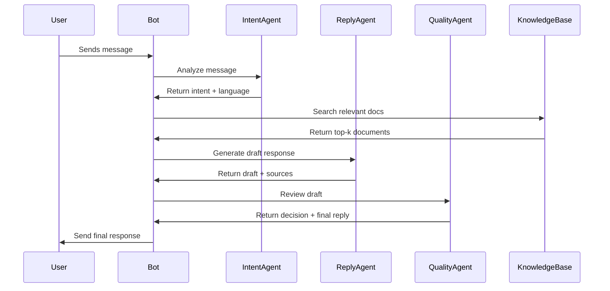

# Architecture Documentation

## System Overview

Discord Multi-Agent Support System is a sophisticated customer service automation system that uses multiple AI agents working collaboratively to provide 24/7 support in Discord communities.

## Architecture Diagram

```
┌─────────────────────────────────────────────────────────────┐
│                    Discord Server                       │
└────────────────────┬────────────────────────────────────┘
                     │
              ┌──────▼──────┐
              │   Discord   │
              │    Bot      │
              └──────┬──────┘
                     │
        ┌────────────┼────────────┐
        │            │            │
   ┌────▼───┐   ┌───▼────┐   ┌───▼────┐
   │ Intent │   │ Reply  │   │Quality │
   │ Agent  │──▶│ Agent  │──▶│ Agent  │
   └────────┘   └────────┘   └────────┘
        │            │            │
        └────────────┼────────────┘
                     │
              ┌──────▼──────┐
              │  Knowledge  │
              │    Base     │
              │  (RAG)      │
              └─────────────┘
```

## Agent Responsibilities

### 1. Intent Agent
- **Role**: Message analysis and intent classification
- **Input**: User message + metadata
- **Output**: Intent type, confidence, language detection
- **Temperature**: 0.3 (low for accuracy)

### 2. Reply Agent
- **Role**: Professional response generation
- **Input**: User message + intent + knowledge base context
- **Output**: Draft response with sources
- **Temperature**: 0.7 (balanced creativity/accuracy)

### 3. Quality Agent
- **Role**: Response quality assurance
- **Input**: Original message + draft response
- **Output**: Approval decision + optional rewrite
- **Temperature**: 0.2 (strict for compliance)

## Data Flow



## Technology Stack

| Component | Technology |
|-----------|------------|
| Discord Bot | discord.py 2.3.2 |
| Agent Orchestration | Hermes Agent (via OpenAI-compatible API) |
| Knowledge Retrieval | Custom RAG engine (TF-IDF + keyword matching) |
| Language Detection | Simple Unicode range detection ( upgradable to langdetect) |
| Configuration | YAML + environment variables |
| Logging | Python logging module |

## Extensibility

### Adding New Intent Types
1. Update `intent_types` in `IntentAgent`
2. Add prompt template in `ReplyAgent`
3. Update documentation

### Adding New Agents
1. Inherit from `BaseAgent`
2. Implement `process()` method
3. Register in `bot.py`

### Upgrading RAG
Replace `RAGEngine` with:
- ChromaDB for vector storage
- Sentence-transformers for embeddings
- FAISS for fast similarity search

## Performance Considerations

- **Response time**: Target < 10 seconds
- **Token usage**: ~2000 tokens per interaction (3 agents)
- **Concurrency**: Asyncio-based, supports multiple guilds
- **Caching**: Consider caching intent classifications for similar messages

## Security

- Store tokens in `.env` (never commit)
- Validate user inputs
- Rate limiting (consider adding)
- Content filtering (Quality Agent provides basic filtering)

## Monitoring

Key metrics to track:
- Intent classification accuracy
- Response quality scores
- Human handoff rate
- Average response time
- Token consumption per day